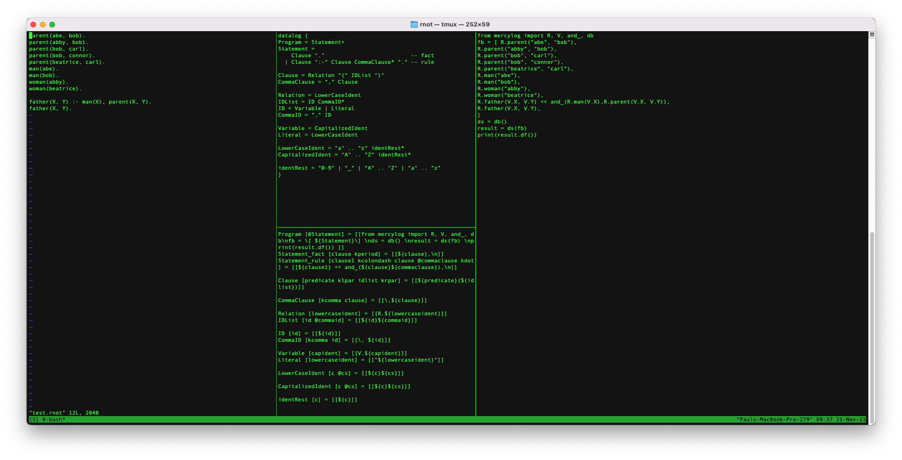

rnot - Rajiv's Notation

1. create a new terminal window
2. use tmux to split the window 4 ways (1:2:1)
   a suggested layout is shown in the diagram below:
   
3. run `./view0` in the first window
4. run `./view1a` in the second window
5. run `./view1b` in the third window
6. run `./view2` in the fourth window
7. make a change using VIM (or whatever editor you choose) to the file (windows 1, 2 or 3), save it, watch the fourth window

N.B. view0/1a/1b use VIM as the editor, change those scripts if you want another editor

